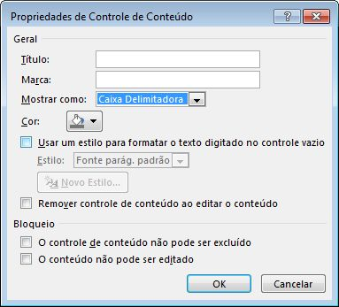
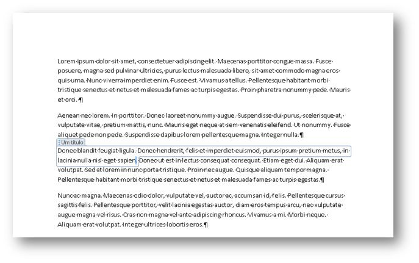
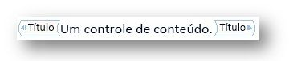
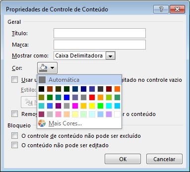
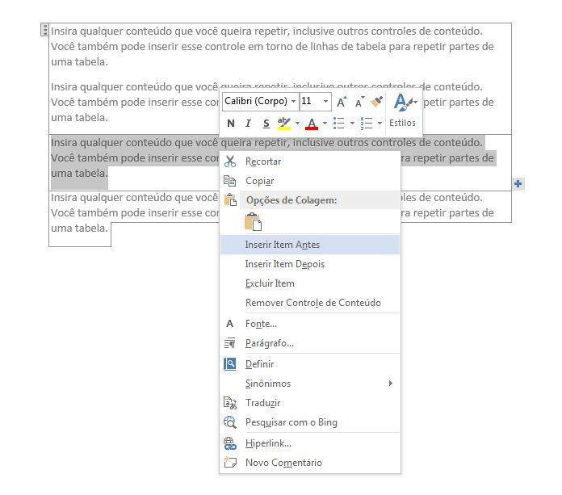
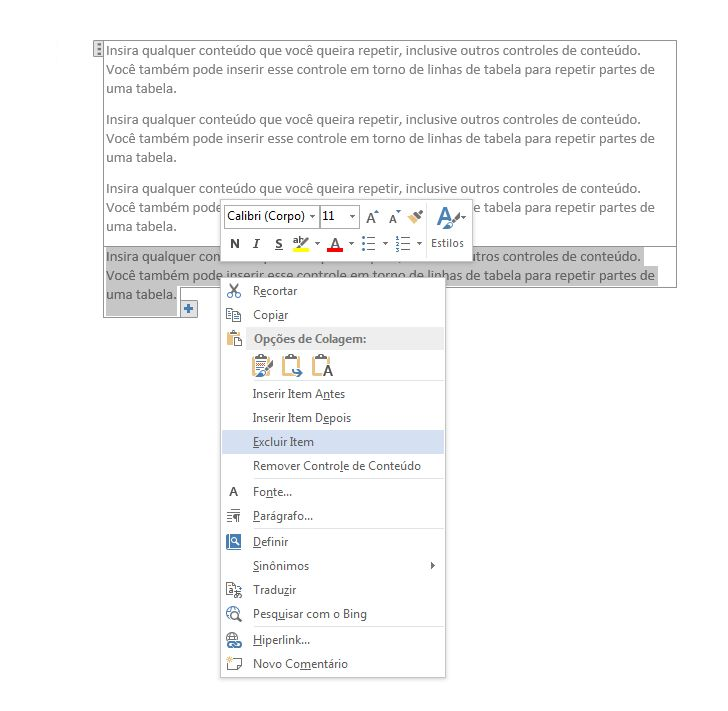
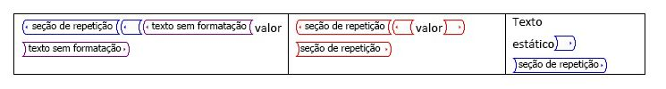
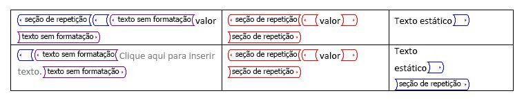

# <a name="content-controls-in-word"></a>Controles de conteúdo no Word

Saiba como os controles de conteúdo do Microsoft Word 2013 disponibilizam uma gama maior de cenários de documentos estruturados.

Este tópico fornece informações sobre alterações nos controles de conteúdo no Microsoft Word 2013 e os cenários de documentos que essas alterações habilitam.
  
### <a name="structured-documents"></a>Documentos estruturados
<a name="WordCC_StructuredDocs"> </a>

Documentos estruturados são documentos que controlam onde o conteúdo pode aparecer em um documento, que tipo de conteúdo pode aparecer no documento e se o conteúdo pode ser editado.
  
Aqui estão alguns cenários comuns para conteúdo estruturado no Microsoft Word:
  
- Um escritório jurídico precisa criar documentos com linguagem jurídica que não devem ser alterados pelo usuário.
    
- Uma empresa precisa criar uma folha de rosto para uma proposta em que somente o título, o autor e a data são inseridos pelo usuário.
    
- Uma empresa precisa criar faturas em que os dados do cliente são incluídos nelas em regiões predefinidas.
    
### <a name="using-content-controls-to-structure-a-document"></a>Como usar controles de conteúdo para estruturar um documento
<a name="WordCC_StructuredDocs"> </a>

Controles de conteúdo são entidades do Microsoft Word que atuam como contêineres para conteúdo específico em um documento. Controles de conteúdo individuais podem ter conteúdo, como datas, listas ou parágrafos de texto formatado. Controles de conteúdo ajudam a criar blocos de conteúdo avançados e estruturados e foram projetados para uso em modelos que inserem blocos bem definidos em documentos, criando documentos estruturados.
  
Controles de conteúdo são ideais para criar documentos estruturados, pois ajudam a corrigir a posição do conteúdo, especificar o tipo de conteúdo (por exemplo, uma data, uma imagem ou um texto), restringir ou habilitar a edição e adicionar significado semântico ao conteúdo.
  
### <a name="content-controls-in-word-2010"></a>Controles de conteúdo no Word 2010
<a name="WordCC_StructuredDocs"> </a>

Os seguintes controles de conteúdo estão disponíveis no Word 2010:
  
- Rich Text
    
- Texto simples
    
- Imagem
    
- Galeria de blocos de construção
    
- Caixa de Combinação
    
- Lista Suspensa
    
- Data
    
- Caixa de seleção
    
- Grupo
    
Os controles de conteúdo do Word 2010 habilitam diversas soluções possíveis de documentos estruturados, mas, no Word 2013, os controles de conteúdo habilitam uma variedade ainda maior de cenários.
  
## <a name="content-control-improvements-in-word-2013"></a>Aprimoramentos do controle de conteúdo no Word 2013
<a name="WordCC_WhatsNew"> </a>

No Word 2013, os controles de conteúdo fornecem três aprimoramentos principais: melhor visualização, suporte para mapeamento de XML para controles de conteúdo de Rich Text e um novo controle de conteúdo para conteúdo repetido.
  
### <a name="improved-visualization"></a>Melhor visualização

O Word 2013 permite que um controle de conteúdo individual apareça em um destes três estados possíveis:
  
- Caixa delimitadora
    
- Marcas de início/fim
    
- Nenhum
    
> [!NOTE]
> Se não especificado algo em contrário, esta seção discute a visualização de controles de conteúdo quando o documento não é exibido no **Modo de Design**. Você define o modo de exibição para um controle de conteúdo usando o controle de lista suspensa **Mostrar como** na caixa de diálogo **Propriedades de Controle de Conteúdo**. 
  
**Figura 1. Caixa de diálogo Propriedades de Controle de Conteúdo**


  
Você também pode definir o modo de exibição de um controle de conteúdo usando o modelo de objeto do Word 2013 (discutido mais adiante em [Novos membros de modelo de objeto controle de conteúdo do Word 2013](#WordCC_NewOM)).
  
### <a name="bounding-box"></a>Caixa delimitadora
<a name="WordCC_DefaultRendering"> </a>

A renderização padrão para controles de conteúdo no Word 2013 consiste em preservar a aparência dos controles de conteúdo da forma como aparecem no Word 2007 e no Word 2010, ou seja, como uma caixa delimitadora. Quando um controle de conteúdo é definido para ser mostrado como uma **Caixa Delimitadora**, a exibição é alterada dependendo da seguinte interação do usuário:
  
- Quando o controle de conteúdo não tem o foco, a visualização não ocorre
    
- Quando o ponteiro do mouse é colocado sobre ele, o controle de conteúdo é exibido como um retângulo sombreado
    
**Figura 2. Controle de conteúdo com o ponteiro do mouse colocado sobre ele**


  
- Quando o controle de conteúdo tem o foco (quando o usuário escolhe o controle de conteúdo), o controle aparece como uma "caixa delimitadora" (com uma linha ao redor do conteúdo e mostrando o título, se um título tiver sido definido)
    
**Figura 3. Controle de conteúdo com foco**


  
### <a name="startend-tags"></a>Marcas de início/fim
<a name="WordCC_StartEndTags"> </a>

Quando o controle de conteúdo é definido para ser mostrado como **Marca de Início/Fim**, as marcas são exibidas independentemente da interação do usuário, e o título nunca aparece; no entanto, botões como **Lista Suspensa** são mostrados quando o ponteiro do mouse é colocado sobre ele. 
  
**Figura 4. Controle de conteúdo definido para ser mostrado como marcas de início/fim**


  
### <a name="none"></a>Nenhum
<a name="WordCC_Invisible"> </a>

Quando o controle de conteúdo é definido para ser mostrado como **Nenhum**, ele não é exibido.
  
### <a name="content-control-colorization"></a>Colorização de controle de conteúdo
<a name="WordCC_CCColorization"> </a>

Além de habilitar um tipo diferente de exibição para um controle de conteúdo, o Word 2013 também ajuda a definir a cor de um controle de conteúdo individual. Você define a cor de um controle de conteúdo usando o botão **Cor** na caixa de diálogo **Propriedades de Controle de Conteúdo**. 
  
Você também pode definir a cor de um controle de conteúdo usando o modelo de objeto do Word 2013 (discutido mais adiante em [Novos membros de modelo de objeto controle de conteúdo do Word 2013](#WordCC_NewOM)).
  
**Figura 5. Caixa de diálogo Propriedades de Controle de Conteúdo**


  
### <a name="support-for-xml-mapping-for-rich-text-content-controls"></a>Suporte para mapeamento de XML para controles de conteúdo de rich text
<a name="WordCC_XMLMapping"> </a>

O Word 2013 ajuda a mapear o conteúdo de controles de conteúdo de rich text e controles de conteúdo de blocos de construção de documentos para o repositório de dados XML. Para fazer isso, defina o *mapeamento de XML* para o controle de conteúdo. Você pode definir essa propriedade utilizando o método **XMLMapping.SetMapping** existente no modelo de objeto. Na parte XML personalizada, o XML personalizado é armazenado como marcação simples do Open XML convertida em uma cadeia de caracteres (usando a codificação XML padrão). Assim, ele pode ser armazenado como um nó de texto na parte XML personalizada. No entanto, o mapeamento continua a ter a limitação de que só pode mapear com êxito os atributos ou nós de folhas. 
  
> [!NOTE]
> Controles de conteúdo de rich text não podem ter outros controles de conteúdo de rich text. Se houver um dentro de outro (por exemplo, devido a manipulação de formato de arquivo, cópia e colagem e assim por diante), ele será desvinculado até que não esteja mais está contido em um controle de rich text mapeado. 
  
Para obter mais informações sobre como configurar um mapeamento de XML, confira a seção [Novos membros do modelo de objeto controle de conteúdo do Word 2013](#WordCC_NewOM) mais adiante neste tópico. 
  
### <a name="supporting-repeating-content"></a>Suporte a conteúdo de repetição
<a name="WordCC_SupportingRepeating"> </a>

Além de melhorias de visualização e suporte para o mapeamento de XML para controles de conteúdo de rich text, o Word 2013 também adiciona um novo controle de conteúdo que habilita você a repetir conteúdo. O controle de conteúdo da seção recorrente repete o conteúdo que está dentro dele, inclusive outros controles de conteúdo.
  
Você insere o controle de conteúdo de seção recorrente ao redor de parágrafos inteiros ou linhas de tabela. Depois que o controle envolve uma seção, você pode inserir cópias da seção acima ou abaixo da seção contida.
  
**Figura 6. Menu de contexto de controle de conteúdo de seção recorrente**


  
Você pode repetir a seção inserida usando o controle na extremidade do controle de conteúdo, exibido como um botão com um sinal de adição (), ou escolhendo um comando no menu de contexto, como mostra a Figura 6. O conteúdo repetido se torna uma seção separada do controle, à qual você pode atribuir um título usando a caixa de diálogo **Propriedades de Controle de Conteúdo**. 
  
**Figura 7. Atribuir um título à seção na caixa de diálogo Propriedades de Controle de Conteúdo**


  
Após dar um título a uma seção, se você selecionar **Permitir aos usuários adicionar e remover seções** na caixa de diálogo **Propriedades de Controle de Conteúdo**, os usuários poderão adicionar ou excluir a seção pelo nome. 
  
**Figura 8. Usar o menu de contexto de controle de conteúdo de seção recorrente para excluir uma seção**


  
Quando o controle de conteúdo de uma seção recorrente envolve outros controles de conteúdo, os controles de conteúdo incluídos são repetidos em cada novo item. Porém, o conteúdo desses controles é redefinido como um texto de espaço reservado. Há duas exceções em que o conteúdo do controle filho é preservado: 
  
- Quando um controle filho é um controle de seção recorrente.
    
- Quando um controle filho tem mapeamento de XML para um nó fora do controle de conteúdo de seção recorrente.
    
**Figura 9. Controle de conteúdo de seção recorrente com controles filho antes da repetição**


  
**Figura 10. Controle de conteúdo de seção recorrente com controles filho depois da repetição**


  
### <a name="repeating-section-content-controls-around-xml-mapped-controls"></a>Controles de conteúdo de seção recorrente em torno de controles com mapeamento de XML
<a name="WordCC_RepeatingSectionCCs"> </a>

Para mapeamentos de XML que estão contidos em uma seção recorrente, o Word 2013 os mapeia da maneira a seguir.
  
Se o mapeamento não interseccionar um item no conjunto de nós como parte da cadeia pai, a associação será uma "associação absoluta" e mostrará o mesmo conteúdo em todos os itens de seção recorrente.
  
Se o mapeamento interseccionar um item no conjunto de nós como parte da cadeia pai, a associação será uma "associação relativa" e será remapeada da seguinte maneira:
  
- A associação absoluta para o nó é determinada (removendo todas as expressões de consulta), o que deve ocorrer no mapeamento inicial
    
- O eixo da associação que intersecciona o conjunto de nós é removido
    
- O restante do XPath é avaliado em relação ao XPath do item de conteúdo de seção recorrente
    
Por exemplo, os seguintes mapeamentos podem ocorrer:
  
- A seção recorrente é mapeada para \root\next\path
    
- O controle do item de exemplo é mapeado para \root\next\path[2]\baz
    
- O Word faz a correspondência entre \root\next\path[2] e um item no conjunto de nós
    
Portanto, a associação é avaliada como .\baz, em que a base é o nó do item de conteúdo de repetição.
  
As sugestões a seguir para trabalhar com controles de conteúdo de repetição podem ajudar você a evitar a perda de dados e frustrações.
  
### <a name="working-with-repeating-section-content-controls-that-are-mapped-to-xml-data"></a>Como trabalhar com controles de conteúdo de seção recorrente que são mapeados para dados XML
<a name="WordCC_RepeatingSectionCCs"> </a>

Se você inserir um controle de conteúdo de seção recorrente que esteja mapeado para dados XML, sempre que o usuário abrir novamente o documento, o Word recriará os itens de seção recorrente com base nas informações no repositório de dados. Mesmo que você salve o documento, as alterações feitas pelo usuário nos itens de seção recorrente no documento que não forem mapeadas também no repositório de dados serão perdidas.
  
Para impedir que isso aconteça, bloqueie o controle de conteúdo de seção recorrente e permita que o usuário edite somente em controles de conteúdo filho desbloqueados que também estejam mapeados para o XML.
  
### <a name="binding-a-repeating-section-content-control-to-a-table"></a>Como associar um controle de conteúdo de seção recorrente a uma tabela
<a name="WordCC_RepeatingSectionCCs"> </a>

Se você quiser associar um controle de conteúdo de seção recorrente a uma tabela, insira uma tabela e, *em seguida*, insira o controle de conteúdo de seção recorrente, não o oposto. (Caso contrário, você não poderá selecionar somente a tabela.) 
  
### <a name="nesting-repeating-section-content-controls-within-a-table"></a>Como aninhar controles de conteúdo de seção recorrente dentro de uma tabela
<a name="WordCC_RepeatingSectionCCs"> </a>

O aninhamento de controles de conteúdo de seção recorrente rigidamente dentro de uma tabela (por exemplo, quando o fim do controle de conteúdo de seção recorrente pai e filho está na mesma célula) faz com que a seção recorrente externa seja excluída quando um item é adicionado ou removido da seção interna.
  
Você pode evitar que isso aconteça adicionando um marcador de parágrafo entre o fim de um controle de conteúdo de seção recorrente e o seguinte. Para ocultar o marcador de parágrafo, desmarque a opção **Mostrar/Ocultar** na guia **Página Inicial** da faixa de opções. 
  
### <a name="open-xml-file-format-schema-additions"></a>Adições de esquema de Formato de Arquivo Open XML
<a name="WordCC"> </a>

Os elementos a seguir foram adicionados ao esquema de Formato de Arquivo Open XML WordprocessingML.
  
**Tabela 1. Novos elementos no esquema de Formato de Arquivo Open XML WordprocessingML para controles de conteúdo**

|**Elemento**|**Descrição**|
|:-----|:-----|
|\<w:appearance\>  <br/> |\<w:appearance\> é um elemento filho de \<w:sdtPr\>.  <br/> Os seguintes valores são válidos para o atributo val:  <br/> \<w:appearance val= boundingBox|marcações|ocultas.  <br/> O valor padrão é boundingBox.  <br/> |
|\<w:color\>  <br/> |\<w:color\> é um elemento filho de \<w:sdtPr\>.  <br/> O modelo de conteúdo corresponde ao tipo complexo de CT_Color existente. O valor padrão é a cor usada no Word 2010.  <br/> |
   
## <a name="new-word-2013-content-control-object-model-members"></a>Novos membros do modelo de objeto controle de conteúdo do Word 2013
<a name="WordCC_NewOM"> </a>

Com as novas melhorias e adições para controles de conteúdo no Word 2013, o modelo de objeto do Word foi atualizado para permitir a manipulação programática do novo conjunto de recursos. Além disso, também foram feitas alterações no Formato de Arquivo Open XML subjacente para documentos de processamento de texto.
  
As seções a seguir fornecem mais informações sobre as alterações de modelo de objeto específicas relacionadas a cada aprimoramento de controle de conteúdo.
  
### <a name="visualization-enhancements"></a>Melhorias de visualização
<a name="WordCC_VisEnhancements"> </a>

Várias adições de modelos de objeto foram incluídas no Word 2013 para melhorias de visualização de controle de conteúdo. A tabela a seguir lista novos membros do objeto **ContentControl** para visualização. 
  
**Tabela 2. Novos membros de objeto ContentControl**

|**Membro**|**Descrição**|
|:-----|:-----|
|. **Appearance** como **WdContentControlAppearance** <br/> |Obtém ou define a visualização do controle de conteúdo.  <br/> |
|. **Color** como **WdColor** <br/> |Obtém ou define a cor do controle de conteúdo.  <br/> |
   
A tabela a seguir lista as constantes na nova enumeração **WdContentControlAppearance**. 
  
**Tabela 3. Constantes na nova enumeração WdContentControlAppearance**

|**Constante**|**Descrição**|
|:-----|:-----|
|**wdContentControlBoundingBox** <br/> |Representa um controle de conteúdo mostrado como um retângulo sombreado/caixa delimitadora (com título opcional).  <br/> |
|**wdContentControlTags** <br/> |Representa um controle de conteúdo mostrado como marcadores de início/fim.  <br/> |
|**wdContentControlHidden** <br/> |Representa um controle de conteúdo que não é mostrado.  <br/> |
   
### <a name="code-sample"></a>Exemplo de código
<a name="WordCC_VisEnhancements"> </a>

O exemplo de código a seguir mostra como criar controles de conteúdo de rich text e definir a visualização de forma programática.
  
```vb
Sub testVisualization()
   Dim objcc As ContentControl
   Dim objRange As Range
   
   ' Get the first paragraph as a range object.
   Set objRange = ActiveDocument.Paragraphs(1).Range
   ' Create a rich text content control around the first paragraph.
   Set objcc = ActiveDocument.ContentControls.Add(wdContentControlRichText, objRange)
   objcc.Title = "Default Bounding Box"
   ' Set visualization to the default.
   objcc.Appearance = wdContentControlBoundingBox
   
   ' Create a new paragraph.
   objRange.InsertParagraphAfter
   Set objRange = ActiveDocument.Paragraphs(2).Range
   ' Create a rich text content control around the second paragraph.
   Set objcc = ActiveDocument.ContentControls.Add(wdContentControlRichText, objRange)
   objcc.Title = "Non Bounding"
   ' Set visualization to invisible.
   objcc.Appearance = wdContentControlHidden
   
   ' Create a new paragraph.
   objRange.InsertParagraphAfter
   Set objRange = ActiveDocument.Paragraphs(3).Range
   ' Create a rich text content control around the third paragraph.
   Set objcc = ActiveDocument.ContentControls.Add(wdContentControlRichText, objRange)
   objcc.Title = "Tags Only with Pink color"
   ' Set visualization to Start/End tags with pink color.
   objcc.Appearance = wdContentControlTags
   objcc.Color = wdColorPink
End Sub
```

### <a name="xml-mapping"></a>Mapeamento de XML
<a name="WordCC_XMLMappingOM"> </a>

Nenhuma adição foi feita ao modelo de objeto do Word 2013 para acomodar o mapeamento de rich text para nós XML no repositório de dados do documento. Em vez disso, use o modelo de objeto existente para mapear um controle de conteúdo de rich text para um nó XML no repositório de dados do documento. Além disso, não foram feitas alterações no esquema WordprocessingML de Formato de Arquivo Open XML subjacente como parte do suporte a controle de conteúdo de rich text recém-incluído especificamente para o mapeamento de XML.
  
#### <a name="code-sample"></a>Exemplo de código

O exemplo de código a seguir mostra como mapear um controle de conteúdo de rich text para um nó XML de forma programática.
  
```vb
Sub testRichBinding()
   Dim objRange As Range
   Dim objcc As ContentControl
   Dim objCustomPart As CustomXMLPart
   Dim blnMap As Boolean
   
   ' Add a custom XML part to the data store.
   Set objCustomPart = ActiveDocument.CustomXMLParts.Add
   ' Load XML fragment into the custom XML part.
   objCustomPart.LoadXML ("<x>Rich Text Databinding</x>")
   ' Get the first paragraph as a range object.
   Set objRange = ActiveDocument.Paragraphs(1).Range
   ' Create a rich text content control around the first paragraph.
   Set objcc = ActiveDocument.ContentControls.Add(wdContentControlRichText, objRange)
   ' Bind the XML node to the rich text content control.
   blnMap = objcc.XMLMapping.SetMapping("/x")
   ' Return whether mapping worked.
   MsgBox objcc.XMLMapping.IsMapped
End Sub
```

### <a name="repeating-section-content-controls-represented-in-the-object-model"></a>Controles de conteúdo de seção recorrente representados no modelo de objeto
<a name="WordCC_RepeatingSection"> </a>

O controle de conteúdo de seção recorrente está disponível no modelo de objeto usando as seguintes adições para o objeto **ContentControl** e os novos objetos **RepeatingSectionItem** e **RepeatingSectionItemColl**. A Tabela 4 lista os novos membros mais importantes do objeto **ContentControl** para controles de conteúdo de seção recorrente. 
  
**Tabela 4. Membros de objeto ContentControl**

|**Membro**|**Descrição**|
|:-----|:-----|
|**AllowInsertDeleteSection** como **Booliano** <br/> |Obtém ou define se os usuários podem adicionar ou remover seções do controle de conteúdo usando a interface do usuário. Se essa propriedade for chamada para um controle de conteúdo que não seja do tipo de seção recorrente, a chamada falhará com esta mensagem de erro: "Esta propriedade só pode ser usada com controles de conteúdo da seção recorrente".  <br/> |
|**RepeatingSectionItemTitle** como **String** <br/> |Obtém ou define o nome de itens de seção recorrente usados no menu de contexto. Se essa propriedade for chamada para um controle de conteúdo que não seja do tipo de seção recorrente, a chamada falhará: "Esta propriedade só pode ser usada com controles de conteúdo da seção recorrente".  <br/> |
|**InsertRepeatingSectionItemBefore** como **ContentControl** <br/> |Adiciona um item de seção recorrente antes do item atual e retorna o novo item de seção recorrente. Se esse método for chamado para um controle de conteúdo que não seja do tipo item de seção recorrente, a chamada falhará: "Esta propriedade só pode ser usada com controles de conteúdo de item da seção recorrente".  <br/> |
|**InsertRepeatingSectionItemAfter** como **ContentControl** <br/> |Adiciona um item de seção recorrente depois do item atual e retorna o novo item de seção recorrente. Se esse método for chamado para um controle de conteúdo que não seja do tipo item de seção recorrente, a chamada falhará: "Esta propriedade só pode ser usada com controles de conteúdo de item da seção recorrente".  <br/> |
   
A Tabela 5 lista os membros mais importantes do objeto **RepeatingSectionItem**. 
  
**Tabela 5. Membros do objeto RepeatingSectionItem**

|**Membro**|**Descrição**|
|:-----|:-----|
|**Range** como **Range** <br/> |Retorna o intervalo do item de seção recorrente especificado, excluindo as marcas de início e de fim.  <br/> |
|**Delete** <br/> |Exclui o item de seção recorrente especificado.  <br/> |
|**InsertItemAfter** como **RepeatingSectionItem** <br/> |Adiciona um item de seção recorrente depois do item especificado e retorna o novo item.  <br/> |
|**InsertItemBefore** como **RepeatingSectionItem** <br/> |Adiciona um item de seção recorrente antes do item especificado e retorna o novo item.  <br/> |
   
A Tabela 6 lista os membros mais importantes do objeto **RepeatingSectionItemColl**. 
  
**Tabela 6. Membros do objeto RepeatingSectionItemColl**

|**Membro**|**Descrição**|
|:-----|:-----|
|**Item** como **RepeatingSectionItem** <br/> |Retorna um item de seção recorrente individual.  <br/> |
   
A Tabela 7 mostra o novo membro da enumeração **WdContentControlType** para controles de conteúdo de seção recorrente. 
  
**Tabela 7. Adição de enumeração WdContentControlType**

|**Constante**|**Descrição**|
|:-----|:-----|
|**wdContentControlRepeatingSection** <br/> |Representa um controle de conteúdo que contém um único item em uma seção recorrente.  <br/> |
   
### <a name="code-sample"></a>Exemplo de código
<a name="WordCC_RepeatingSection"> </a>

O exemplo de código a seguir mostra como usar controles de conteúdo de seção recorrente de forma programática.
  
```vb
Sub testRepeatingSectionControl()
   Dim objRange As Range
   Dim objTable As Table
   Dim objCustomPart As CustomXMLPart
   Dim objCC As ContentControl
   Dim objCustomNode As CustomXMLNode
   
   Set objCustomPart = ActiveDocument.CustomXMLParts.Add
   objCustomPart.LoadXML ("<books>" & _
       "<book><title>Everyday Italian</title>" & _
       "<author>Giada De Laurentiis</author></book>" & _
       "<book><title>Harry Potter</title>" & _
       "<author>J K. Rowling</author></book>" & _
       "<book><title>Learning XML</title>" & _
       "<author>Erik T. Ray</author></book></books>")
   
   Set objRange = ActiveDocument.Paragraphs(1).Range
   Set objTable = ActiveDocument.Tables.Add(objRange, 2, 2)
   With objTable.Borders
       .InsideLineStyle = wdLineStyleSingle
       .OutsideLineStyle = wdLineStyleDouble
   End With
   Set objRange = objTable.Cell(1, 1).Range
   Set objCustomNode = objCustomPart.SelectSingleNode("/books[1]/book[1]/title[1]")
   Set objCC = ActiveDocument.ContentControls.Add(wdContentControlText, objRange)
   objCC.XMLMapping.SetMappingByNode objCustomNode
   Set objRange = objTable.Cell(1, 2).Range
   Set objCustomNode = objCustomPart.SelectSingleNode("/books[1]/book[1]/author[1]")
   Set objCC = ActiveDocument.ContentControls.Add(wdContentControlText, objRange)
   objCC.XMLMapping.SetMappingByNode objCustomNode
   Set objRange = objTable.Rows(1).Range
   Set objCC = ActiveDocument.ContentControls.Add(wdContentControlRepeatingSection, objRange)
   objCC.XMLMapping.SetMapping ("/books[1]/book")
End Sub
```

### <a name="open-xml-file-format-changes-for-repeating-section-content-controls"></a>Alterações do Formato de Arquivo Open XML para controles de conteúdo de seção recorrente
<a name="WordCC_RepeatingSection"> </a>

A representação de formato de arquivo de um controle de conteúdo de seção recorrente geralmente usa os mesmos nomes de elemento, valores, e assim por diante que a marcação XML existente. No entanto, o elemento \<sdt\> que representa o contêiner de seção recorrente externo existe no namespace do Word 2013 para garantir a compatibilidade com versões anteriores do Word.
  
Os itens de repetição individuais dentro do controle de conteúdo de seção recorrente (que envolvem cada item individual) são salvos como controles de conteúdo de rich text usando a representação WordprocessingML existente. A Tabela 8 lista novos elementos no esquema WordprocessingML para controles de conteúdo de seção recorrente.
  
**Tabela 8. Novos elementos no esquema WordprocessingML para controles de conteúdo de seção recorrente**

|**Elemento**|**Descrição**|
|:-----|:-----|
|\<w15:repeatingSection\>  <br/> |Especifica um controle de conteúdo de seção recorrente. Esse elemento é mutuamente exclusivo com todos os outros tipos de controle e não tem elementos filho nem atributos.  <br/> |
|\<w15:repeatingSectionItem\>  <br/> |Especifica um controle de conteúdo de item de seção recorrente. Esse elemento é mutuamente exclusivo com todos os outros tipos de controle e não tem elementos filho nem atributos.  <br/> |
|\<w15:doNotAllowInsertDeleteSection\>  <br/> |Especifica que o usuário não pode adicionar nem excluir seções por meio da interface do usuário no Word 2013.  <br/> |
|\<w15:sectionTitle\>  <br/> |Especifica o nome de itens de seção recorrente (e é usado no menu de contexto quando o controle é escolhido).  <br/> |
   

  

