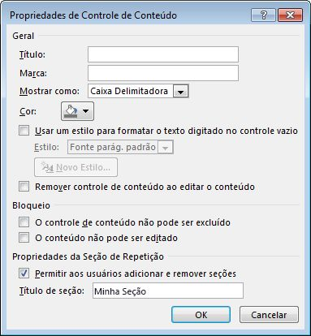

# <a name="content-controls-in-word"></a><span data-ttu-id="3db4e-104">Controles de conteúdo no Word</span><span class="sxs-lookup"><span data-stu-id="3db4e-104">Content controls in Word</span></span>

<span data-ttu-id="3db4e-105">Saiba como os controles de conteúdo do Microsoft Word 2013 disponibilizam uma gama maior de cenários de documentos estruturados.</span><span class="sxs-lookup"><span data-stu-id="3db4e-105">Learn how Microsoft Word 2013 content controls enable a larger range of structured document scenarios.</span></span>

<span data-ttu-id="3db4e-106">Este tópico fornece informações sobre alterações nos controles de conteúdo no Microsoft Word 2013 e os cenários de documentos que essas alterações habilitam.</span><span class="sxs-lookup"><span data-stu-id="3db4e-106">This topic provides information about changes to content controls in Microsoft Word 2013 and the document scenarios that those changes enable.</span></span>
  
### <a name="structured-documents"></a><span data-ttu-id="3db4e-107">Documentos estruturados</span><span class="sxs-lookup"><span data-stu-id="3db4e-107">Structured documents</span></span>
<span data-ttu-id="3db4e-108"><a name="WordCC_StructuredDocs"> </a></span><span class="sxs-lookup"><span data-stu-id="3db4e-108"></span></span>

<span data-ttu-id="3db4e-109">Documentos estruturados são documentos que controlam onde o conteúdo pode aparecer em um documento, que tipo de conteúdo pode aparecer no documento e se o conteúdo pode ser editado.</span><span class="sxs-lookup"><span data-stu-id="3db4e-109">Structured documents are documents that control where content can appear on a document, what kind of content can appear in the document, and whether that content can be edited.</span></span>
  
<span data-ttu-id="3db4e-110">Aqui estão alguns cenários comuns para conteúdo estruturado no Microsoft Word:</span><span class="sxs-lookup"><span data-stu-id="3db4e-110">Here are some common scenarios for structured content in Microsoft Word:</span></span>
  
- <span data-ttu-id="3db4e-111">Um escritório jurídico precisa criar documentos com linguagem jurídica que não devem ser alterados pelo usuário.</span><span class="sxs-lookup"><span data-stu-id="3db4e-111">A legal firm needs to create documents that contain legal language that should not be changed by the user.</span></span>
    
- <span data-ttu-id="3db4e-112">Uma empresa precisa criar uma folha de rosto para uma proposta em que somente o título, o autor e a data são inseridos pelo usuário.</span><span class="sxs-lookup"><span data-stu-id="3db4e-112">A business needs to create a proposal cover page where only the title, author, and date are entered by the user.</span></span>
    
- <span data-ttu-id="3db4e-113">Uma empresa precisa criar faturas em que os dados do cliente são incluídos nelas em regiões predefinidas.</span><span class="sxs-lookup"><span data-stu-id="3db4e-113">A business needs to create invoices where the customer data is included in the invoice at predefined regions.</span></span>
    
### <a name="using-content-controls-to-structure-a-document"></a><span data-ttu-id="3db4e-114">Como usar controles de conteúdo para estruturar um documento</span><span class="sxs-lookup"><span data-stu-id="3db4e-114">Using content controls to structure a document</span></span>
<span data-ttu-id="3db4e-115"><a name="WordCC_StructuredDocs"> </a></span><span class="sxs-lookup"><span data-stu-id="3db4e-115"></span></span>

<span data-ttu-id="3db4e-116">Controles de conteúdo são entidades do Microsoft Word que atuam como contêineres para conteúdo específico em um documento.</span><span class="sxs-lookup"><span data-stu-id="3db4e-116">Content controls are Microsoft Word entities that act as containers for specific content in a document.</span></span> <span data-ttu-id="3db4e-117">Controles de conteúdo individuais podem ter conteúdo, como datas, listas ou parágrafos de texto formatado.</span><span class="sxs-lookup"><span data-stu-id="3db4e-117">Individual content controls can contain content such as dates, lists, or paragraphs of formatted text.</span></span> <span data-ttu-id="3db4e-118">Controles de conteúdo ajudam a criar blocos de conteúdo avançados e estruturados e foram projetados para uso em modelos que inserem blocos bem definidos em documentos, criando documentos estruturados.</span><span class="sxs-lookup"><span data-stu-id="3db4e-118">Content controls help you to create rich, structured blocks of content and are designed for use in templates that insert well-defined blocks into your documents, creating structured documents.</span></span>
  
<span data-ttu-id="3db4e-119">Controles de conteúdo são ideais para criar documentos estruturados, pois ajudam a corrigir a posição do conteúdo, especificar o tipo de conteúdo (por exemplo, uma data, uma imagem ou um texto), restringir ou habilitar a edição e adicionar significado semântico ao conteúdo.</span><span class="sxs-lookup"><span data-stu-id="3db4e-119">Content controls are ideal for creating structured documents because content controls help you fix the position of content, specify the kind of content (for example, a date, a picture, or text), restrict or enable editing, and add semantic meaning to content.</span></span>
  
### <a name="content-controls-in-word-2010"></a><span data-ttu-id="3db4e-120">Controles de conteúdo no Word 2010</span><span class="sxs-lookup"><span data-stu-id="3db4e-120">Content controls in Word 2010</span></span>
<span data-ttu-id="3db4e-121"><a name="WordCC_StructuredDocs"> </a></span><span class="sxs-lookup"><span data-stu-id="3db4e-121"></span></span>

<span data-ttu-id="3db4e-122">Os seguintes controles de conteúdo estão disponíveis no Word 2010:</span><span class="sxs-lookup"><span data-stu-id="3db4e-122">The following content controls are available in Word 2010:</span></span>
  
- <span data-ttu-id="3db4e-123">Rich Text</span><span class="sxs-lookup"><span data-stu-id="3db4e-123">Rich Text</span></span>
    
- <span data-ttu-id="3db4e-124">Texto simples</span><span class="sxs-lookup"><span data-stu-id="3db4e-124">Plain Text</span></span>
    
- <span data-ttu-id="3db4e-125">Imagem</span><span class="sxs-lookup"><span data-stu-id="3db4e-125">Picture</span></span>
    
- <span data-ttu-id="3db4e-126">Galeria de blocos de construção</span><span class="sxs-lookup"><span data-stu-id="3db4e-126">Building Block Gallery</span></span>
    
- <span data-ttu-id="3db4e-127">Caixa de Combinação</span><span class="sxs-lookup"><span data-stu-id="3db4e-127">Combo Box</span></span>
    
- <span data-ttu-id="3db4e-128">Lista Suspensa</span><span class="sxs-lookup"><span data-stu-id="3db4e-128">Drop-Down List</span></span>
    
- <span data-ttu-id="3db4e-129">Data</span><span class="sxs-lookup"><span data-stu-id="3db4e-129">Date</span></span>
    
- <span data-ttu-id="3db4e-130">Caixa de seleção</span><span class="sxs-lookup"><span data-stu-id="3db4e-130">Checkbox</span></span>
    
- <span data-ttu-id="3db4e-131">Grupo</span><span class="sxs-lookup"><span data-stu-id="3db4e-131">Group</span></span>
    
<span data-ttu-id="3db4e-132">Os controles de conteúdo do Word 2010 habilitam diversas soluções possíveis de documentos estruturados, mas, no Word 2013, os controles de conteúdo habilitam uma variedade ainda maior de cenários.</span><span class="sxs-lookup"><span data-stu-id="3db4e-132">Word 2010 content controls enable various potential structured document solutions, but in Word 2013 content controls enable a greater range of scenarios.</span></span>
  
## <a name="content-control-improvements-in-word-2013"></a><span data-ttu-id="3db4e-133">Aprimoramentos do controle de conteúdo no Word 2013</span><span class="sxs-lookup"><span data-stu-id="3db4e-133">Content control improvements in Word 2013</span></span>
<span data-ttu-id="3db4e-134"><a name="WordCC_WhatsNew"> </a></span><span class="sxs-lookup"><span data-stu-id="3db4e-134"></span></span>

<span data-ttu-id="3db4e-135">No Word 2013, os controles de conteúdo fornecem três aprimoramentos principais: melhor visualização, suporte para mapeamento de XML para controles de conteúdo de Rich Text e um novo controle de conteúdo para conteúdo repetido.</span><span class="sxs-lookup"><span data-stu-id="3db4e-135">In Word 2013, content controls provide three key improvements: improved visualization, support for XML Mapping for Rich Text content controls, and a new content control for repeating content.</span></span>
  
### <a name="improved-visualization"></a><span data-ttu-id="3db4e-136">Melhor visualização</span><span class="sxs-lookup"><span data-stu-id="3db4e-136">Improved visualization</span></span>

<span data-ttu-id="3db4e-137">O Word 2013 permite que um controle de conteúdo individual apareça em um destes três estados possíveis:</span><span class="sxs-lookup"><span data-stu-id="3db4e-137">Word 2013 allows an individual content control to appear in one of three possible states:</span></span>
  
- <span data-ttu-id="3db4e-138">Caixa delimitadora</span><span class="sxs-lookup"><span data-stu-id="3db4e-138">Bounding box</span></span>
    
- <span data-ttu-id="3db4e-139">Marcas de início/fim</span><span class="sxs-lookup"><span data-stu-id="3db4e-139">Start/End tags</span></span>
    
- <span data-ttu-id="3db4e-140">Nenhum</span><span class="sxs-lookup"><span data-stu-id="3db4e-140">None</span></span>
    
> [!NOTE]
> <span data-ttu-id="3db4e-141">Se não especificado algo em contrário, esta seção discute a visualização de controles de conteúdo quando o documento não é exibido no **Modo de Design**. Você define o modo de exibição para um controle de conteúdo usando o controle de lista suspensa **Mostrar como** na caixa de diálogo **Propriedades de Controle de Conteúdo**.</span><span class="sxs-lookup"><span data-stu-id="3db4e-141">If not stated otherwise, this section discusses the visualization of content controls when the document is not viewed in **Design Mode**.You set the display mode for a content control by using the **Show as** drop-down list control in the **Content Control Properties** dialog box.</span></span> 
  
<span data-ttu-id="3db4e-142">**Figura 1. Caixa de diálogo Propriedades de Controle de Conteúdo**</span><span class="sxs-lookup"><span data-stu-id="3db4e-142">**Figure 1. Content Control Properties dialog box**</span></span>

<span data-ttu-id="3db4e-143"></span><span class="sxs-lookup"><span data-stu-id="3db4e-143"></span></span>
  
<span data-ttu-id="3db4e-144">Você também pode definir o modo de exibição de um controle de conteúdo usando o modelo de objeto do Word 2013 (discutido mais adiante em [Novos membros de modelo de objeto controle de conteúdo do Word 2013](#WordCC_NewOM)).</span><span class="sxs-lookup"><span data-stu-id="3db4e-144">You can also set the display mode for a content control by using the Word 2013 object model (discussed later in [New Word 2013 content control object model members](#WordCC_NewOM)).</span></span>
  
### <a name="bounding-box"></a><span data-ttu-id="3db4e-145">Caixa delimitadora</span><span class="sxs-lookup"><span data-stu-id="3db4e-145">Bounding box</span></span>
<span data-ttu-id="3db4e-146"><a name="WordCC_DefaultRendering"> </a></span><span class="sxs-lookup"><span data-stu-id="3db4e-146"></span></span>

<span data-ttu-id="3db4e-147">A renderização padrão para controles de conteúdo no Word 2013 consiste em preservar a aparência dos controles de conteúdo da forma como aparecem no Word 2007 e no Word 2010, ou seja, como uma caixa delimitadora.</span><span class="sxs-lookup"><span data-stu-id="3db4e-147">The default rendering for content controls in Word 2013 is to preserve the look of content controls as they appear in Word 2007 and Word 2010; that is, as a bounding box.</span></span> <span data-ttu-id="3db4e-148">Quando um controle de conteúdo é definido para ser mostrado como uma **Caixa Delimitadora**, a exibição é alterada dependendo da seguinte interação do usuário:</span><span class="sxs-lookup"><span data-stu-id="3db4e-148">When a content control is set to show as **Bounding Box**, the display changes depending upon the following user interaction:</span></span>
  
- <span data-ttu-id="3db4e-149">Quando o controle de conteúdo não tem o foco, a visualização não ocorre</span><span class="sxs-lookup"><span data-stu-id="3db4e-149">When the content control does not have the focus, no visualization occurs</span></span>
    
- <span data-ttu-id="3db4e-150">Quando o ponteiro do mouse é colocado sobre ele, o controle de conteúdo é exibido como um retângulo sombreado</span><span class="sxs-lookup"><span data-stu-id="3db4e-150">On mouse-over, the content control appears as a shaded rectangle</span></span>
    
<span data-ttu-id="3db4e-151">**Figura 2. Controle de conteúdo com o ponteiro do mouse colocado sobre ele**</span><span class="sxs-lookup"><span data-stu-id="3db4e-151">**Figure 2. Content control on mouse-over**</span></span>

<span data-ttu-id="3db4e-152"></span><span class="sxs-lookup"><span data-stu-id="3db4e-152"></span></span>
  
- <span data-ttu-id="3db4e-153">Quando o controle de conteúdo tem o foco (quando o usuário escolhe o controle de conteúdo), o controle aparece como uma "caixa delimitadora" (com uma linha ao redor do conteúdo e mostrando o título, se um título tiver sido definido)</span><span class="sxs-lookup"><span data-stu-id="3db4e-153">When the content control has the focus (when the user chooses the content control), the control appears as a "bounding box" (with a line around the content and the title showing, if a title has been set)</span></span>
    
<span data-ttu-id="3db4e-154">**Figura 3. Controle de conteúdo com foco**</span><span class="sxs-lookup"><span data-stu-id="3db4e-154">**Figure 3. Content control with focus**</span></span>

<span data-ttu-id="3db4e-155"></span><span class="sxs-lookup"><span data-stu-id="3db4e-155"></span></span>
  
### <a name="startend-tags"></a><span data-ttu-id="3db4e-156">Marcas de início/fim</span><span class="sxs-lookup"><span data-stu-id="3db4e-156">Start/End tags</span></span>
<span data-ttu-id="3db4e-157"><a name="WordCC_StartEndTags"> </a></span><span class="sxs-lookup"><span data-stu-id="3db4e-157"></span></span>

<span data-ttu-id="3db4e-158">Quando o controle de conteúdo é definido para ser mostrado como **Marca de Início/Fim**, as marcas são exibidas independentemente da interação do usuário, e o título nunca aparece; no entanto, botões como **Lista Suspensa** são mostrados quando o ponteiro do mouse é colocado sobre ele.</span><span class="sxs-lookup"><span data-stu-id="3db4e-158">When the content control is set to show as **Start/End tag**, the tags are displayed regardless of user interaction, and the title never appears; but buttons, such as the **Drop-Down List** button, appear on mouse over.</span></span> 
  
<span data-ttu-id="3db4e-159">**Figura 4. Controle de conteúdo definido para ser mostrado como marcas de início/fim**</span><span class="sxs-lookup"><span data-stu-id="3db4e-159">**Figure 4. Content control set to show as start/end tags**</span></span>

<span data-ttu-id="3db4e-160"></span><span class="sxs-lookup"><span data-stu-id="3db4e-160"></span></span>
  
### <a name="none"></a><span data-ttu-id="3db4e-161">Nenhum</span><span class="sxs-lookup"><span data-stu-id="3db4e-161">None</span></span>
<span data-ttu-id="3db4e-162"><a name="WordCC_Invisible"> </a></span><span class="sxs-lookup"><span data-stu-id="3db4e-162"></span></span>

<span data-ttu-id="3db4e-163">Quando o controle de conteúdo é definido para ser mostrado como **Nenhum**, ele não é exibido.</span><span class="sxs-lookup"><span data-stu-id="3db4e-163">When the content control is set to show as **None**, the content control is not displayed.</span></span>
  
### <a name="content-control-colorization"></a><span data-ttu-id="3db4e-164">Colorização de controle de conteúdo</span><span class="sxs-lookup"><span data-stu-id="3db4e-164">Content control colorization</span></span>
<span data-ttu-id="3db4e-165"><a name="WordCC_CCColorization"> </a></span><span class="sxs-lookup"><span data-stu-id="3db4e-165"></span></span>

<span data-ttu-id="3db4e-166">Além de habilitar um tipo diferente de exibição para um controle de conteúdo, o Word 2013 também ajuda a definir a cor de um controle de conteúdo individual.</span><span class="sxs-lookup"><span data-stu-id="3db4e-166">In addition to enabling a different kind of display for a content control, Word 2013 also helps you to set the color for an individual content control.</span></span> <span data-ttu-id="3db4e-167">Você define a cor de um controle de conteúdo usando o botão **Cor** na caixa de diálogo **Propriedades de Controle de Conteúdo**.</span><span class="sxs-lookup"><span data-stu-id="3db4e-167">You set the color of a content control by using the **Color** button in the **Content Control Properties** dialog box.</span></span> 
  
<span data-ttu-id="3db4e-168">Você também pode definir a cor de um controle de conteúdo usando o modelo de objeto do Word 2013 (discutido mais adiante em [Novos membros de modelo de objeto controle de conteúdo do Word 2013](#WordCC_NewOM)).</span><span class="sxs-lookup"><span data-stu-id="3db4e-168">You can also set the color of a content control by using the Word 2013 object model (discussed later in [New Word 2013 content control object model members](#WordCC_NewOM)).</span></span>
  
<span data-ttu-id="3db4e-169">**Figura 5. Caixa de diálogo Propriedades de Controle de Conteúdo**</span><span class="sxs-lookup"><span data-stu-id="3db4e-169">**Figure 5. Content Control Properties dialog box**</span></span>

<span data-ttu-id="3db4e-170"></span><span class="sxs-lookup"><span data-stu-id="3db4e-170"></span></span>
  
### <a name="support-for-xml-mapping-for-rich-text-content-controls"></a><span data-ttu-id="3db4e-171">Suporte para mapeamento de XML para controles de conteúdo de rich text</span><span class="sxs-lookup"><span data-stu-id="3db4e-171">Support for XML mapping for rich text content controls</span></span>
<span data-ttu-id="3db4e-172"><a name="WordCC_XMLMapping"> </a></span><span class="sxs-lookup"><span data-stu-id="3db4e-172"></span></span>

<span data-ttu-id="3db4e-173">O Word 2013 ajuda a mapear o conteúdo de controles de conteúdo de rich text e controles de conteúdo de blocos de construção de documentos para o repositório de dados XML.</span><span class="sxs-lookup"><span data-stu-id="3db4e-173">Word 2013 helps you to map the content of rich text content controls and document building block content controls to the XML data store.</span></span> <span data-ttu-id="3db4e-174">Para fazer isso, defina o *mapeamento de XML* para o controle de conteúdo.</span><span class="sxs-lookup"><span data-stu-id="3db4e-174">To do this, you set the  *XML mapping*  for the content control.</span></span> <span data-ttu-id="3db4e-175">Você pode definir essa propriedade utilizando o método **XMLMapping.SetMapping** existente no modelo de objeto.</span><span class="sxs-lookup"><span data-stu-id="3db4e-175">You can set this property by using the existing **XMLMapping.SetMapping** method in the object model.</span></span> <span data-ttu-id="3db4e-176">Na parte XML personalizada, o XML personalizado é armazenado como marcação simples do Open XML convertida em uma cadeia de caracteres (usando a codificação XML padrão). Assim, ele pode ser armazenado como um nó de texto na parte XML personalizada.</span><span class="sxs-lookup"><span data-stu-id="3db4e-176">Within the custom XML part, the custom XML is stored as flat Open XML markup converted into a string (by using standard XML encoding), so that it can be stored as a text node in the custom XML part.</span></span> <span data-ttu-id="3db4e-177">No entanto, o mapeamento continua a ter a limitação de que só pode mapear com êxito os atributos ou nós de folhas.</span><span class="sxs-lookup"><span data-stu-id="3db4e-177">However, the mapping continues to have the limitation that it can only successfully map to leaf nodes or attributes.</span></span> 
  
> [!NOTE]
> <span data-ttu-id="3db4e-p105">Controles de conteúdo de rich text não podem ter outros controles de conteúdo de rich text. Se houver um dentro de outro (por exemplo, devido a manipulação de formato de arquivo, cópia e colagem e assim por diante), ele será desvinculado até que não esteja mais está contido em um controle de rich text mapeado.</span><span class="sxs-lookup"><span data-stu-id="3db4e-p105">Rich text content controls cannot contain other rich text content controls. If one exists inside of another (for example, because of file format manipulation, copy and paste, and so on), it is unlinked until it is no longer contained inside a mapped rich text control.</span></span> 
  
<span data-ttu-id="3db4e-180">Para obter mais informações sobre como configurar um mapeamento de XML, confira a seção [Novos membros do modelo de objeto controle de conteúdo do Word 2013](#WordCC_NewOM) mais adiante neste tópico.</span><span class="sxs-lookup"><span data-stu-id="3db4e-180">For more information about how to set up XML mapping, see the section [New Word 2013 content control object model members](#WordCC_NewOM) later in this topic.</span></span> 
  
### <a name="supporting-repeating-content"></a><span data-ttu-id="3db4e-181">Suporte a conteúdo de repetição</span><span class="sxs-lookup"><span data-stu-id="3db4e-181">Supporting repeating content</span></span>
<span data-ttu-id="3db4e-182"><a name="WordCC_SupportingRepeating"> </a></span><span class="sxs-lookup"><span data-stu-id="3db4e-182"></span></span>

<span data-ttu-id="3db4e-183">Além de melhorias de visualização e suporte para o mapeamento de XML para controles de conteúdo de rich text, o Word 2013 também adiciona um novo controle de conteúdo que habilita você a repetir conteúdo.</span><span class="sxs-lookup"><span data-stu-id="3db4e-183">In addition to visualization enhancements and support for XML mapping to rich text content controls, Word 2013 also adds a new content control that enables you to repeat content.</span></span> <span data-ttu-id="3db4e-184">O controle de conteúdo da seção recorrente repete o conteúdo que está dentro dele, inclusive outros controles de conteúdo.</span><span class="sxs-lookup"><span data-stu-id="3db4e-184">The repeating section content control repeats the content contained within it, including other content controls.</span></span>
  
<span data-ttu-id="3db4e-p107">Você insere o controle de conteúdo de seção recorrente ao redor de parágrafos inteiros ou linhas de tabela. Depois que o controle envolve uma seção, você pode inserir cópias da seção acima ou abaixo da seção contida.</span><span class="sxs-lookup"><span data-stu-id="3db4e-p107">You insert the repeating section content control around entire paragraphs or table rows. Once the control surrounds a section, you can insert copies of the section above or below the contained section.</span></span>
  
<span data-ttu-id="3db4e-187">**Figura 6. Menu de contexto de controle de conteúdo de seção recorrente**</span><span class="sxs-lookup"><span data-stu-id="3db4e-187">**Figure 6. Repeating section content control context menu**</span></span>

<span data-ttu-id="3db4e-188"></span><span class="sxs-lookup"><span data-stu-id="3db4e-188"></span></span>
  
<span data-ttu-id="3db4e-189">Você pode repetir a seção inserida usando o controle na extremidade do controle de conteúdo, exibido como um botão com um sinal de adição (), ou escolhendo um comando no menu de contexto, como mostra a Figura 6.</span><span class="sxs-lookup"><span data-stu-id="3db4e-189">You can repeat the inserted section by using either the control on the end of the content control (displayed as a button with a plus sign ()) or by choosing a command on the context menu, as shown in Figure 6.</span></span> <span data-ttu-id="3db4e-190">O conteúdo repetido se torna uma seção separada do controle, à qual você pode atribuir um título usando a caixa de diálogo **Propriedades de Controle de Conteúdo**.</span><span class="sxs-lookup"><span data-stu-id="3db4e-190">The repeated content becomes a separate section of the control that you can assign a title by using the **Content Control Properties** dialog box.</span></span> 
  
<span data-ttu-id="3db4e-191">**Figura 7. Atribuir um título à seção na caixa de diálogo Propriedades de Controle de Conteúdo**</span><span class="sxs-lookup"><span data-stu-id="3db4e-191">**Figure 7. Assign a section title in the Content Control Properties dialog box**</span></span>

<span data-ttu-id="3db4e-192"></span><span class="sxs-lookup"><span data-stu-id="3db4e-192"></span></span>
  
<span data-ttu-id="3db4e-193">Após dar um título a uma seção, se você selecionar **Permitir aos usuários adicionar e remover seções** na caixa de diálogo **Propriedades de Controle de Conteúdo**, os usuários poderão adicionar ou excluir a seção pelo nome.</span><span class="sxs-lookup"><span data-stu-id="3db4e-193">Once you have given the section a title, if you select **Allow users to add and remove sections** in the **Content Control Properties** dialog box, users can add or delete the section by name.</span></span> 
  
<span data-ttu-id="3db4e-194">**Figura 8. Usar o menu de contexto de controle de conteúdo de seção recorrente para excluir uma seção**</span><span class="sxs-lookup"><span data-stu-id="3db4e-194">**Figure 8. Use the repeating section content control context menu to delete a section**</span></span>

<span data-ttu-id="3db4e-195"></span><span class="sxs-lookup"><span data-stu-id="3db4e-195"></span></span>
  
<span data-ttu-id="3db4e-p109">Quando o controle de conteúdo de uma seção recorrente envolve outros controles de conteúdo, os controles de conteúdo incluídos são repetidos em cada novo item. Porém, o conteúdo desses controles é redefinido como um texto de espaço reservado. Há duas exceções em que o conteúdo do controle filho é preservado:</span><span class="sxs-lookup"><span data-stu-id="3db4e-p109">When a repeating section content control surrounds other content controls, the enclosed content controls are repeated in each new item; but any such content controls have their contents reset to placeholder text. There are two exceptions where child control contents are preserved:</span></span> 
  
- <span data-ttu-id="3db4e-198">Quando um controle filho é um controle de seção recorrente.</span><span class="sxs-lookup"><span data-stu-id="3db4e-198">When a child control is a repeating section control.</span></span>
    
- <span data-ttu-id="3db4e-199">Quando um controle filho tem mapeamento de XML para um nó fora do controle de conteúdo de seção recorrente.</span><span class="sxs-lookup"><span data-stu-id="3db4e-199">When a child control is XML-mapped to a node outside the repeating section content control.</span></span>
    
<span data-ttu-id="3db4e-200">**Figura 9. Controle de conteúdo de seção recorrente com controles filho antes da repetição**</span><span class="sxs-lookup"><span data-stu-id="3db4e-200">**Figure 9. Repeating section content control containing child controls before repeat**</span></span>

<span data-ttu-id="3db4e-201"></span><span class="sxs-lookup"><span data-stu-id="3db4e-201"></span></span>
  
<span data-ttu-id="3db4e-202">**Figura 10. Controle de conteúdo de seção recorrente com controles filho depois da repetição**</span><span class="sxs-lookup"><span data-stu-id="3db4e-202">**Figure 10. Repeating section content control containing child controls after repeat**</span></span>

<span data-ttu-id="3db4e-203"></span><span class="sxs-lookup"><span data-stu-id="3db4e-203"></span></span>
  
### <a name="repeating-section-content-controls-around-xml-mapped-controls"></a><span data-ttu-id="3db4e-204">Controles de conteúdo de seção recorrente em torno de controles com mapeamento de XML</span><span class="sxs-lookup"><span data-stu-id="3db4e-204">Repeating section content controls around XML-mapped controls</span></span>
<span data-ttu-id="3db4e-205"><a name="WordCC_RepeatingSectionCCs"> </a></span><span class="sxs-lookup"><span data-stu-id="3db4e-205"></span></span>

<span data-ttu-id="3db4e-206">Para mapeamentos de XML que estão contidos em uma seção recorrente, o Word 2013 os mapeia da maneira a seguir.</span><span class="sxs-lookup"><span data-stu-id="3db4e-206">For XML mappings that are contained in a repeating section, Word 2013 maps them as follows.</span></span>
  
<span data-ttu-id="3db4e-207">Se o mapeamento não interseccionar um item no conjunto de nós como parte da cadeia pai, a associação será uma "associação absoluta" e mostrará o mesmo conteúdo em todos os itens de seção recorrente.</span><span class="sxs-lookup"><span data-stu-id="3db4e-207">If the mapping does not intersect with an item in the node set as part of its parent chain, the binding is an "absolute binding" and shows the same content in all repeating section items.</span></span>
  
<span data-ttu-id="3db4e-208">Se o mapeamento interseccionar um item no conjunto de nós como parte da cadeia pai, a associação será uma "associação relativa" e será remapeada da seguinte maneira:</span><span class="sxs-lookup"><span data-stu-id="3db4e-208">If the mapping does intersect with an item in the node set as part of its parent chain, the binding is a "relative binding", and is remapped as follows:</span></span>
  
- <span data-ttu-id="3db4e-209">A associação absoluta para o nó é determinada (removendo todas as expressões de consulta), o que deve ocorrer no mapeamento inicial</span><span class="sxs-lookup"><span data-stu-id="3db4e-209">The absolute binding for the node is determined (flattening out any query expressions)─this should happen on initial mapping</span></span>
    
- <span data-ttu-id="3db4e-210">O eixo da associação que intersecciona o conjunto de nós é removido</span><span class="sxs-lookup"><span data-stu-id="3db4e-210">The axis of the binding that intersects with the node set is removed</span></span>
    
- <span data-ttu-id="3db4e-211">O restante do XPath é avaliado em relação ao XPath do item de conteúdo de seção recorrente</span><span class="sxs-lookup"><span data-stu-id="3db4e-211">The remainder of the XPath is evaluated relative to the XPath of the repeating section content item</span></span>
    
<span data-ttu-id="3db4e-212">Por exemplo, os seguintes mapeamentos podem ocorrer:</span><span class="sxs-lookup"><span data-stu-id="3db4e-212">For example, the following mappings might occur:</span></span>
  
- <span data-ttu-id="3db4e-213">A seção recorrente é mapeada para \root\next\path</span><span class="sxs-lookup"><span data-stu-id="3db4e-213">The repeating section is mapped to \root\next\path</span></span>
    
- <span data-ttu-id="3db4e-214">O controle do item de exemplo é mapeado para \root\next\path[2]\baz</span><span class="sxs-lookup"><span data-stu-id="3db4e-214">The control in the sample item is mapped to \root\next\path[2]\baz</span></span>
    
- <span data-ttu-id="3db4e-215">O Word faz a correspondência entre \root\next\path[2] e um item no conjunto de nós</span><span class="sxs-lookup"><span data-stu-id="3db4e-215">Word matches \root\next\path[2] to an item in the node set</span></span>
    
<span data-ttu-id="3db4e-216">Portanto, a associação é avaliada como .\baz, em que a base é o nó do item de conteúdo de repetição.</span><span class="sxs-lookup"><span data-stu-id="3db4e-216">The binding is therefore evaluated as .\baz, where the base is the node of the repeating content item.</span></span>
  
<span data-ttu-id="3db4e-217">As sugestões a seguir para trabalhar com controles de conteúdo de repetição podem ajudar você a evitar a perda de dados e frustrações.</span><span class="sxs-lookup"><span data-stu-id="3db4e-217">The following suggestions for working with repeating content controls can help you prevent data loss and avoid frustration.</span></span>
  
### <a name="working-with-repeating-section-content-controls-that-are-mapped-to-xml-data"></a><span data-ttu-id="3db4e-218">Como trabalhar com controles de conteúdo de seção recorrente que são mapeados para dados XML</span><span class="sxs-lookup"><span data-stu-id="3db4e-218">Working with repeating section content controls that are mapped to XML data</span></span>
<span data-ttu-id="3db4e-219"><a name="WordCC_RepeatingSectionCCs"> </a></span><span class="sxs-lookup"><span data-stu-id="3db4e-219"></span></span>

<span data-ttu-id="3db4e-220">Se você inserir um controle de conteúdo de seção recorrente que esteja mapeado para dados XML, sempre que o usuário abrir novamente o documento, o Word recriará os itens de seção recorrente com base nas informações no repositório de dados.</span><span class="sxs-lookup"><span data-stu-id="3db4e-220">If you insert a repeating section content control that is mapped to XML data, every time your user reopens the document, Word recreates the repeating section items, based on the information in the data store.</span></span> <span data-ttu-id="3db4e-221">Mesmo que você salve o documento, as alterações feitas pelo usuário nos itens de seção recorrente no documento que não forem mapeadas também no repositório de dados serão perdidas.</span><span class="sxs-lookup"><span data-stu-id="3db4e-221">Even if you save the document, any changes that the user makes in the repeating section items in the document that aren't also mapped into the data store are lost.</span></span>
  
<span data-ttu-id="3db4e-222">Para impedir que isso aconteça, bloqueie o controle de conteúdo de seção recorrente e permita que o usuário edite somente em controles de conteúdo filho desbloqueados que também estejam mapeados para o XML.</span><span class="sxs-lookup"><span data-stu-id="3db4e-222">To help prevent this from happening, lock the repeating section content control and allow the user to edit only in unlocked child content controls that are mapped to the XML as well.</span></span>
  
### <a name="binding-a-repeating-section-content-control-to-a-table"></a><span data-ttu-id="3db4e-223">Como associar um controle de conteúdo de seção recorrente a uma tabela</span><span class="sxs-lookup"><span data-stu-id="3db4e-223">Binding a repeating section content control to a table</span></span>
<span data-ttu-id="3db4e-224"><a name="WordCC_RepeatingSectionCCs"> </a></span><span class="sxs-lookup"><span data-stu-id="3db4e-224"></span></span>

<span data-ttu-id="3db4e-225">Se você quiser associar um controle de conteúdo de seção recorrente a uma tabela, insira uma tabela e, *em seguida*, insira o controle de conteúdo de seção recorrente, não o oposto.</span><span class="sxs-lookup"><span data-stu-id="3db4e-225">If you want to bind a repeating section content control to a table, insert the table and  *then*  the insert repeating section content control, and not the other way around.</span></span> <span data-ttu-id="3db4e-226">(Caso contrário, você não poderá selecionar somente a tabela.)</span><span class="sxs-lookup"><span data-stu-id="3db4e-226">(Otherwise, you won't be able to select only the table).</span></span> 
  
### <a name="nesting-repeating-section-content-controls-within-a-table"></a><span data-ttu-id="3db4e-227">Como aninhar controles de conteúdo de seção recorrente dentro de uma tabela</span><span class="sxs-lookup"><span data-stu-id="3db4e-227">Nesting repeating section content controls within a table</span></span>
<span data-ttu-id="3db4e-228"><a name="WordCC_RepeatingSectionCCs"> </a></span><span class="sxs-lookup"><span data-stu-id="3db4e-228"></span></span>

<span data-ttu-id="3db4e-229">O aninhamento de controles de conteúdo de seção recorrente rigidamente dentro de uma tabela (por exemplo, quando o fim do controle de conteúdo de seção recorrente pai e filho está na mesma célula) faz com que a seção recorrente externa seja excluída quando um item é adicionado ou removido da seção interna.</span><span class="sxs-lookup"><span data-stu-id="3db4e-229">Nesting repeating section content controls tightly within a table (for example, when the end of the parent and child repeating section content control is in the same cell) causes the outer repeating section to be deleted when the inner section has an item added or removed.</span></span>
  
<span data-ttu-id="3db4e-p112">Você pode evitar que isso aconteça adicionando um marcador de parágrafo entre o fim de um controle de conteúdo de seção recorrente e o seguinte. Para ocultar o marcador de parágrafo, desmarque a opção **Mostrar/Ocultar** na guia **Página Inicial** da faixa de opções.</span><span class="sxs-lookup"><span data-stu-id="3db4e-p112">You can prevent this from happening by adding a paragraph marker between the end of one repeating section content control and the next. To hide the paragraph marker, deselect the **Show/Hide** option on the **Home** tab of the ribbon.</span></span> 
  
### <a name="open-xml-file-format-schema-additions"></a><span data-ttu-id="3db4e-232">Adições de esquema de Formato de Arquivo Open XML</span><span class="sxs-lookup"><span data-stu-id="3db4e-232">Open XML File Format schema additions</span></span>
<span data-ttu-id="3db4e-233"><a name="WordCC"> </a></span><span class="sxs-lookup"><span data-stu-id="3db4e-233"></span></span>

<span data-ttu-id="3db4e-234">Os elementos a seguir foram adicionados ao esquema de Formato de Arquivo Open XML WordprocessingML.</span><span class="sxs-lookup"><span data-stu-id="3db4e-234">The following elements were added to the WordprocessingML Open XML File Format schema.</span></span>
  
<span data-ttu-id="3db4e-235">**Tabela 1. Novos elementos no esquema de Formato de Arquivo Open XML WordprocessingML para controles de conteúdo**</span><span class="sxs-lookup"><span data-stu-id="3db4e-235">**Table 1. New elements in the WordprocessingML Open XML File Format schema for content controls**</span></span>

|<span data-ttu-id="3db4e-236">**Elemento**</span><span class="sxs-lookup"><span data-stu-id="3db4e-236">**Element**</span></span>|<span data-ttu-id="3db4e-237">**Descrição**</span><span class="sxs-lookup"><span data-stu-id="3db4e-237">**Description**</span></span>|
|:-----|:-----|
|<span data-ttu-id="3db4e-238">\<w:appearance\></span><span class="sxs-lookup"><span data-stu-id="3db4e-238">\<w:appearance\></span></span>  <br/> |<span data-ttu-id="3db4e-239">\<w:appearance\> é um elemento filho de \<w:sdtPr\>.</span><span class="sxs-lookup"><span data-stu-id="3db4e-239">\<w:appearance\> is a child element of \<w:sdtPr\>.</span></span>  <br/> <span data-ttu-id="3db4e-240">Os seguintes valores são válidos para o atributo val:</span><span class="sxs-lookup"><span data-stu-id="3db4e-240">The following values are valid for the val attribute:</span></span>  <br/> <span data-ttu-id="3db4e-241">\<w:appearance val= boundingBox</span><span class="sxs-lookup"><span data-stu-id="3db4e-241">\<w:appearance val= boundingBox</span></span>|<span data-ttu-id="3db4e-242">marcações</span><span class="sxs-lookup"><span data-stu-id="3db4e-242">tags</span></span>|<span data-ttu-id="3db4e-243">ocultas.</span><span class="sxs-lookup"><span data-stu-id="3db4e-243">hidden.</span></span>  <br/> <span data-ttu-id="3db4e-244">O valor padrão é boundingBox.</span><span class="sxs-lookup"><span data-stu-id="3db4e-244">The default value is boundingBox.</span></span>  <br/> |
|<span data-ttu-id="3db4e-245">\<w:color\></span><span class="sxs-lookup"><span data-stu-id="3db4e-245">\<w:color\></span></span>  <br/> |<span data-ttu-id="3db4e-246">\<w:color\> é um elemento filho de \<w:sdtPr\>.</span><span class="sxs-lookup"><span data-stu-id="3db4e-246">\<w:color\> is a child element of \<w:sdtPr\>.</span></span>  <br/> <span data-ttu-id="3db4e-p113">O modelo de conteúdo corresponde ao tipo complexo de CT_Color existente. O valor padrão é a cor usada no Word 2010.</span><span class="sxs-lookup"><span data-stu-id="3db4e-p113">The content model matches the existing CT_Color complex type. The default value is the color used in Word 2010.</span></span>  <br/> |
   
## <a name="new-word-2013-content-control-object-model-members"></a><span data-ttu-id="3db4e-249">Novos membros do modelo de objeto controle de conteúdo do Word 2013</span><span class="sxs-lookup"><span data-stu-id="3db4e-249">New Word 2013 content control object model members</span></span>
<span data-ttu-id="3db4e-250"><a name="WordCC_NewOM"> </a></span><span class="sxs-lookup"><span data-stu-id="3db4e-250"></span></span>

<span data-ttu-id="3db4e-251">Com as novas melhorias e adições para controles de conteúdo no Word 2013, o modelo de objeto do Word foi atualizado para permitir a manipulação programática do novo conjunto de recursos.</span><span class="sxs-lookup"><span data-stu-id="3db4e-251">With the new enhancements and additions to content controls in Word 2013, the object model for Word has been updated to allow for programmatic manipulation of the new feature set.</span></span> <span data-ttu-id="3db4e-252">Além disso, também foram feitas alterações no Formato de Arquivo Open XML subjacente para documentos de processamento de texto.</span><span class="sxs-lookup"><span data-stu-id="3db4e-252">In addition, changes have also been made to the underlying Open XML File Format for word processing documents.</span></span>
  
<span data-ttu-id="3db4e-253">As seções a seguir fornecem mais informações sobre as alterações de modelo de objeto específicas relacionadas a cada aprimoramento de controle de conteúdo.</span><span class="sxs-lookup"><span data-stu-id="3db4e-253">The following sections provide more information about the specific object model changes related to each content control enhancement.</span></span>
  
### <a name="visualization-enhancements"></a><span data-ttu-id="3db4e-254">Melhorias de visualização</span><span class="sxs-lookup"><span data-stu-id="3db4e-254">Visualization enhancements</span></span>
<span data-ttu-id="3db4e-255"><a name="WordCC_VisEnhancements"> </a></span><span class="sxs-lookup"><span data-stu-id="3db4e-255"></span></span>

<span data-ttu-id="3db4e-256">Várias adições de modelos de objeto foram incluídas no Word 2013 para melhorias de visualização de controle de conteúdo.</span><span class="sxs-lookup"><span data-stu-id="3db4e-256">Several object model additions are included in Word 2013 for content control visualization enhancements.</span></span> <span data-ttu-id="3db4e-257">A tabela a seguir lista novos membros do objeto **ContentControl** para visualização.</span><span class="sxs-lookup"><span data-stu-id="3db4e-257">The following table list new members of the **ContentControl** object for visualization.</span></span> 
  
<span data-ttu-id="3db4e-258">**Tabela 2. Novos membros de objeto ContentControl**</span><span class="sxs-lookup"><span data-stu-id="3db4e-258">**Table 2. New ContentControl object members**</span></span>

|<span data-ttu-id="3db4e-259">**Membro**</span><span class="sxs-lookup"><span data-stu-id="3db4e-259">**Member**</span></span>|<span data-ttu-id="3db4e-260">**Descrição**</span><span class="sxs-lookup"><span data-stu-id="3db4e-260">**Description**</span></span>|
|:-----|:-----|
|<span data-ttu-id="3db4e-261">.</span><span class="sxs-lookup"><span data-stu-id="3db4e-261"></span></span> <span data-ttu-id="3db4e-262">**Appearance** como **WdContentControlAppearance**</span><span class="sxs-lookup"><span data-stu-id="3db4e-262">**Appearance** as **WdContentControlAppearance**</span></span> <br/> |<span data-ttu-id="3db4e-263">Obtém ou define a visualização do controle de conteúdo.</span><span class="sxs-lookup"><span data-stu-id="3db4e-263">Gets or sets the visualization of the content control.</span></span>  <br/> |
|<span data-ttu-id="3db4e-264">.</span><span class="sxs-lookup"><span data-stu-id="3db4e-264"></span></span> <span data-ttu-id="3db4e-265">**Color** como **WdColor**</span><span class="sxs-lookup"><span data-stu-id="3db4e-265">**Color** as **WdColor**</span></span> <br/> |<span data-ttu-id="3db4e-266">Obtém ou define a cor do controle de conteúdo.</span><span class="sxs-lookup"><span data-stu-id="3db4e-266">Gets or sets the color of the content control.</span></span>  <br/> |
   
<span data-ttu-id="3db4e-267">A tabela a seguir lista as constantes na nova enumeração **WdContentControlAppearance**.</span><span class="sxs-lookup"><span data-stu-id="3db4e-267">The following table lists constants in the new **WdContentControlAppearance** enumeration.</span></span> 
  
<span data-ttu-id="3db4e-268">**Tabela 3. Constantes na nova enumeração WdContentControlAppearance**</span><span class="sxs-lookup"><span data-stu-id="3db4e-268">**Table 3. New WdContentControlAppearance enumeration constants**</span></span>

|<span data-ttu-id="3db4e-269">**Constante**</span><span class="sxs-lookup"><span data-stu-id="3db4e-269">**Constant**</span></span>|<span data-ttu-id="3db4e-270">**Descrição**</span><span class="sxs-lookup"><span data-stu-id="3db4e-270">**Description**</span></span>|
|:-----|:-----|
|<span data-ttu-id="3db4e-271">**wdContentControlBoundingBox**</span><span class="sxs-lookup"><span data-stu-id="3db4e-271">**wdContentControlBoundingBox**</span></span> <br/> |<span data-ttu-id="3db4e-272">Representa um controle de conteúdo mostrado como um retângulo sombreado/caixa delimitadora (com título opcional).</span><span class="sxs-lookup"><span data-stu-id="3db4e-272">Represents a content control shown as a shaded rectangle/bounding box (with optional title).</span></span>  <br/> |
|<span data-ttu-id="3db4e-273">**wdContentControlTags**</span><span class="sxs-lookup"><span data-stu-id="3db4e-273">**wdContentControlTags**</span></span> <br/> |<span data-ttu-id="3db4e-274">Representa um controle de conteúdo mostrado como marcadores de início/fim.</span><span class="sxs-lookup"><span data-stu-id="3db4e-274">Represents a content control shown as start/end markers.</span></span>  <br/> |
|<span data-ttu-id="3db4e-275">**wdContentControlHidden**</span><span class="sxs-lookup"><span data-stu-id="3db4e-275">**wdContentControlHidden**</span></span> <br/> |<span data-ttu-id="3db4e-276">Representa um controle de conteúdo que não é mostrado.</span><span class="sxs-lookup"><span data-stu-id="3db4e-276">Represents a content control that is not shown.</span></span>  <br/> |
   
### <a name="code-sample"></a><span data-ttu-id="3db4e-277">Exemplo de código</span><span class="sxs-lookup"><span data-stu-id="3db4e-277">Code sample</span></span>
<span data-ttu-id="3db4e-278"><a name="WordCC_VisEnhancements"> </a></span><span class="sxs-lookup"><span data-stu-id="3db4e-278"></span></span>

<span data-ttu-id="3db4e-279">O exemplo de código a seguir mostra como criar controles de conteúdo de rich text e definir a visualização de forma programática.</span><span class="sxs-lookup"><span data-stu-id="3db4e-279">The following code sample shows how to create rich text content controls and set visualization programmatically.</span></span>
  
```vb
Sub testVisualization()
   Dim objcc As ContentControl
   Dim objRange As Range
   
   ' Get the first paragraph as a range object.
   Set objRange = ActiveDocument.Paragraphs(1).Range
   ' Create a rich text content control around the first paragraph.
   Set objcc = ActiveDocument.ContentControls.Add(wdContentControlRichText, objRange)
   objcc.Title = "Default Bounding Box"
   ' Set visualization to the default.
   objcc.Appearance = wdContentControlBoundingBox
   
   ' Create a new paragraph.
   objRange.InsertParagraphAfter
   Set objRange = ActiveDocument.Paragraphs(2).Range
   ' Create a rich text content control around the second paragraph.
   Set objcc = ActiveDocument.ContentControls.Add(wdContentControlRichText, objRange)
   objcc.Title = "Non Bounding"
   ' Set visualization to invisible.
   objcc.Appearance = wdContentControlHidden
   
   ' Create a new paragraph.
   objRange.InsertParagraphAfter
   Set objRange = ActiveDocument.Paragraphs(3).Range
   ' Create a rich text content control around the third paragraph.
   Set objcc = ActiveDocument.ContentControls.Add(wdContentControlRichText, objRange)
   objcc.Title = "Tags Only with Pink color"
   ' Set visualization to Start/End tags with pink color.
   objcc.Appearance = wdContentControlTags
   objcc.Color = wdColorPink
End Sub
```

### <a name="xml-mapping"></a><span data-ttu-id="3db4e-280">Mapeamento de XML</span><span class="sxs-lookup"><span data-stu-id="3db4e-280">XML mapping</span></span>
<span data-ttu-id="3db4e-281"><a name="WordCC_XMLMappingOM"> </a></span><span class="sxs-lookup"><span data-stu-id="3db4e-281"></span></span>

<span data-ttu-id="3db4e-282">Nenhuma adição foi feita ao modelo de objeto do Word 2013 para acomodar o mapeamento de rich text para nós XML no repositório de dados do documento.</span><span class="sxs-lookup"><span data-stu-id="3db4e-282">No additions were made to the Word 2013 object model to accommodate rich text mapping to XML nodes in the document data store.</span></span> <span data-ttu-id="3db4e-283">Em vez disso, use o modelo de objeto existente para mapear um controle de conteúdo de rich text para um nó XML no repositório de dados do documento.</span><span class="sxs-lookup"><span data-stu-id="3db4e-283">Instead, use the existing object model to map a rich text content control to an XML node in the document data store.</span></span> <span data-ttu-id="3db4e-284">Além disso, não foram feitas alterações no esquema WordprocessingML de Formato de Arquivo Open XML subjacente como parte do suporte a controle de conteúdo de rich text recém-incluído especificamente para o mapeamento de XML.</span><span class="sxs-lookup"><span data-stu-id="3db4e-284">Additionally, no changes were made to the underlying Open XML File Format WordprocessingML schema as part of the newly included rich text content control support specifically for XML mapping.</span></span>
  
#### <a name="code-sample"></a><span data-ttu-id="3db4e-285">Exemplo de código</span><span class="sxs-lookup"><span data-stu-id="3db4e-285">Code sample</span></span>

<span data-ttu-id="3db4e-286">O exemplo de código a seguir mostra como mapear um controle de conteúdo de rich text para um nó XML de forma programática.</span><span class="sxs-lookup"><span data-stu-id="3db4e-286">The following code sample shows how to map a rich text content control to an XML node programmatically.</span></span>
  
```vb
Sub testRichBinding()
   Dim objRange As Range
   Dim objcc As ContentControl
   Dim objCustomPart As CustomXMLPart
   Dim blnMap As Boolean
   
   ' Add a custom XML part to the data store.
   Set objCustomPart = ActiveDocument.CustomXMLParts.Add
   ' Load XML fragment into the custom XML part.
   objCustomPart.LoadXML ("<x>Rich Text Databinding</x>")
   ' Get the first paragraph as a range object.
   Set objRange = ActiveDocument.Paragraphs(1).Range
   ' Create a rich text content control around the first paragraph.
   Set objcc = ActiveDocument.ContentControls.Add(wdContentControlRichText, objRange)
   ' Bind the XML node to the rich text content control.
   blnMap = objcc.XMLMapping.SetMapping("/x")
   ' Return whether mapping worked.
   MsgBox objcc.XMLMapping.IsMapped
End Sub
```

### <a name="repeating-section-content-controls-represented-in-the-object-model"></a><span data-ttu-id="3db4e-287">Controles de conteúdo de seção recorrente representados no modelo de objeto</span><span class="sxs-lookup"><span data-stu-id="3db4e-287">Repeating section content controls represented in the object model</span></span>
<span data-ttu-id="3db4e-288"><a name="WordCC_RepeatingSection"> </a></span><span class="sxs-lookup"><span data-stu-id="3db4e-288"></span></span>

<span data-ttu-id="3db4e-p119">O controle de conteúdo de seção recorrente está disponível no modelo de objeto usando as seguintes adições para o objeto **ContentControl** e os novos objetos **RepeatingSectionItem** e **RepeatingSectionItemColl**. A Tabela 4 lista os novos membros mais importantes do objeto **ContentControl** para controles de conteúdo de seção recorrente.</span><span class="sxs-lookup"><span data-stu-id="3db4e-p119">The repeating section content control is available in the object model by using the following additions to the **ContentControl** object and the new **RepeatingSectionItem** and **RepeatingSectionItemColl** objects. Table 4 lists the most important new members of the **ContentControl** object for repeating section content controls.</span></span> 
  
<span data-ttu-id="3db4e-291">**Tabela 4. Membros de objeto ContentControl**</span><span class="sxs-lookup"><span data-stu-id="3db4e-291">**Table 4. ContentControl object members**</span></span>

|<span data-ttu-id="3db4e-292">**Membro**</span><span class="sxs-lookup"><span data-stu-id="3db4e-292">**Member**</span></span>|<span data-ttu-id="3db4e-293">**Descrição**</span><span class="sxs-lookup"><span data-stu-id="3db4e-293">**Description**</span></span>|
|:-----|:-----|
|<span data-ttu-id="3db4e-294">**AllowInsertDeleteSection** como **Booliano**</span><span class="sxs-lookup"><span data-stu-id="3db4e-294">**AllowInsertDeleteSection** as **Boolean**</span></span> <br/> |<span data-ttu-id="3db4e-295">Obtém ou define se os usuários podem adicionar ou remover seções do controle de conteúdo usando a interface do usuário.</span><span class="sxs-lookup"><span data-stu-id="3db4e-295">Gets or sets whether users can add or remove sections from the content control by using the UI.</span></span> <span data-ttu-id="3db4e-296">Se essa propriedade for chamada para um controle de conteúdo que não seja do tipo de seção recorrente, a chamada falhará com esta mensagem de erro: "Esta propriedade só pode ser usada com controles de conteúdo da seção recorrente".</span><span class="sxs-lookup"><span data-stu-id="3db4e-296">If this property is called for a content control that is not of type repeating section, the call fails with the following error message: "This property can only be used with repeating section content controls."</span></span>  <br/> |
|<span data-ttu-id="3db4e-297">**RepeatingSectionItemTitle** como **String**</span><span class="sxs-lookup"><span data-stu-id="3db4e-297">**RepeatingSectionItemTitle** as **String**</span></span> <br/> |<span data-ttu-id="3db4e-298">Obtém ou define o nome de itens de seção recorrente usados no menu de contexto.</span><span class="sxs-lookup"><span data-stu-id="3db4e-298">Gets or sets the name of repeating section items used in the context menu.</span></span> <span data-ttu-id="3db4e-299">Se essa propriedade for chamada para um controle de conteúdo que não seja do tipo de seção recorrente, a chamada falhará: "Esta propriedade só pode ser usada com controles de conteúdo da seção recorrente".</span><span class="sxs-lookup"><span data-stu-id="3db4e-299">If this property is called for a content control that is not of type repeating section, the call fails with: "This property can only be used with repeating section content controls."</span></span>  <br/> |
|<span data-ttu-id="3db4e-300">**InsertRepeatingSectionItemBefore** como **ContentControl**</span><span class="sxs-lookup"><span data-stu-id="3db4e-300">**InsertRepeatingSectionItemBefore** as **ContentControl**</span></span> <br/> |<span data-ttu-id="3db4e-301">Adiciona um item de seção recorrente antes do item atual e retorna o novo item de seção recorrente.</span><span class="sxs-lookup"><span data-stu-id="3db4e-301">Adds a repeating section item before the current item and returns the new repeating section item.</span></span> <span data-ttu-id="3db4e-302">Se esse método for chamado para um controle de conteúdo que não seja do tipo item de seção recorrente, a chamada falhará: "Esta propriedade só pode ser usada com controles de conteúdo de item da seção recorrente".</span><span class="sxs-lookup"><span data-stu-id="3db4e-302">If this method is called for a content control that is not of type repeating section item, the call fails with: "This property can only be used with repeating section item content controls."</span></span>  <br/> |
|<span data-ttu-id="3db4e-303">**InsertRepeatingSectionItemAfter** como **ContentControl**</span><span class="sxs-lookup"><span data-stu-id="3db4e-303">**InsertRepeatingSectionItemAfter** as **ContentControl**</span></span> <br/> |<span data-ttu-id="3db4e-304">Adiciona um item de seção recorrente depois do item atual e retorna o novo item de seção recorrente.</span><span class="sxs-lookup"><span data-stu-id="3db4e-304">Adds a repeating section item after the current item and returns the new repeating section item.</span></span> <span data-ttu-id="3db4e-305">Se esse método for chamado para um controle de conteúdo que não seja do tipo item de seção recorrente, a chamada falhará: "Esta propriedade só pode ser usada com controles de conteúdo de item da seção recorrente".</span><span class="sxs-lookup"><span data-stu-id="3db4e-305">If this method is called for a content control that is not of type repeating section item, the call fails with: "This property can only be used with repeating section item content controls."</span></span>  <br/> |
   
<span data-ttu-id="3db4e-306">A Tabela 5 lista os membros mais importantes do objeto **RepeatingSectionItem**.</span><span class="sxs-lookup"><span data-stu-id="3db4e-306">Table 5 lists the most important members of the **RepeatingSectionItem** object.</span></span> 
  
<span data-ttu-id="3db4e-307">**Tabela 5. Membros do objeto RepeatingSectionItem**</span><span class="sxs-lookup"><span data-stu-id="3db4e-307">**Table 5. RepeatingSectionItem object members**</span></span>

|<span data-ttu-id="3db4e-308">**Membro**</span><span class="sxs-lookup"><span data-stu-id="3db4e-308">**Member**</span></span>|<span data-ttu-id="3db4e-309">**Descrição**</span><span class="sxs-lookup"><span data-stu-id="3db4e-309">**Description**</span></span>|
|:-----|:-----|
|<span data-ttu-id="3db4e-310">**Range** como **Range**</span><span class="sxs-lookup"><span data-stu-id="3db4e-310">**Range** as **Range**</span></span> <br/> |<span data-ttu-id="3db4e-311">Retorna o intervalo do item de seção recorrente especificado, excluindo as marcas de início e de fim.</span><span class="sxs-lookup"><span data-stu-id="3db4e-311">Returns the range of the specified repeating section item, excluding the start and end tags.</span></span>  <br/> |
|<span data-ttu-id="3db4e-312">**Delete**</span><span class="sxs-lookup"><span data-stu-id="3db4e-312">**Delete**</span></span> <br/> |<span data-ttu-id="3db4e-313">Exclui o item de seção recorrente especificado.</span><span class="sxs-lookup"><span data-stu-id="3db4e-313">Deletes the specified repeating section item.</span></span>  <br/> |
|<span data-ttu-id="3db4e-314">**InsertItemAfter** como **RepeatingSectionItem**</span><span class="sxs-lookup"><span data-stu-id="3db4e-314">**InsertItemAfter** as **RepeatingSectionItem**</span></span> <br/> |<span data-ttu-id="3db4e-315">Adiciona um item de seção recorrente depois do item especificado e retorna o novo item.</span><span class="sxs-lookup"><span data-stu-id="3db4e-315">Adds a repeating section item after the specified item and returns the new item.</span></span>  <br/> |
|<span data-ttu-id="3db4e-316">**InsertItemBefore** como **RepeatingSectionItem**</span><span class="sxs-lookup"><span data-stu-id="3db4e-316">**InsertItemBefore** as **RepeatingSectionItem**</span></span> <br/> |<span data-ttu-id="3db4e-317">Adiciona um item de seção recorrente antes do item especificado e retorna o novo item.</span><span class="sxs-lookup"><span data-stu-id="3db4e-317">Adds a repeating section item before the specified item and returns the new item.</span></span>  <br/> |
   
<span data-ttu-id="3db4e-318">A Tabela 6 lista os membros mais importantes do objeto **RepeatingSectionItemColl**.</span><span class="sxs-lookup"><span data-stu-id="3db4e-318">Table 6 lists the most important members of the **RepeatingSectionItemColl** object.</span></span> 
  
<span data-ttu-id="3db4e-319">**Tabela 6. Membros do objeto RepeatingSectionItemColl**</span><span class="sxs-lookup"><span data-stu-id="3db4e-319">**Table 6. RepeatingSectionItemColl object members**</span></span>

|<span data-ttu-id="3db4e-320">**Membro**</span><span class="sxs-lookup"><span data-stu-id="3db4e-320">**Member**</span></span>|<span data-ttu-id="3db4e-321">**Descrição**</span><span class="sxs-lookup"><span data-stu-id="3db4e-321">**Description**</span></span>|
|:-----|:-----|
|<span data-ttu-id="3db4e-322">**Item** como **RepeatingSectionItem**</span><span class="sxs-lookup"><span data-stu-id="3db4e-322">**Item** as **RepeatingSectionItem**</span></span> <br/> |<span data-ttu-id="3db4e-323">Retorna um item de seção recorrente individual.</span><span class="sxs-lookup"><span data-stu-id="3db4e-323">Returns an individual repeating section item.</span></span>  <br/> |
   
<span data-ttu-id="3db4e-324">A Tabela 7 mostra o novo membro da enumeração **WdContentControlType** para controles de conteúdo de seção recorrente.</span><span class="sxs-lookup"><span data-stu-id="3db4e-324">Table 7 shows the new member of the **WdContentControlType** enumeration for repeating section content controls.</span></span> 
  
<span data-ttu-id="3db4e-325">**Tabela 7. Adição de enumeração WdContentControlType**</span><span class="sxs-lookup"><span data-stu-id="3db4e-325">**Table 7. WdContentControlType enumeration addition**</span></span>

|<span data-ttu-id="3db4e-326">**Constante**</span><span class="sxs-lookup"><span data-stu-id="3db4e-326">**Constant**</span></span>|<span data-ttu-id="3db4e-327">**Descrição**</span><span class="sxs-lookup"><span data-stu-id="3db4e-327">**Description**</span></span>|
|:-----|:-----|
|<span data-ttu-id="3db4e-328">**wdContentControlRepeatingSection**</span><span class="sxs-lookup"><span data-stu-id="3db4e-328">**wdContentControlRepeatingSection**</span></span> <br/> |<span data-ttu-id="3db4e-329">Representa um controle de conteúdo que contém um único item em uma seção recorrente.</span><span class="sxs-lookup"><span data-stu-id="3db4e-329">Represents a content control that contains a single item in a repeating section.</span></span>  <br/> |
   
### <a name="code-sample"></a><span data-ttu-id="3db4e-330">Exemplo de código</span><span class="sxs-lookup"><span data-stu-id="3db4e-330">Code sample</span></span>
<span data-ttu-id="3db4e-331"><a name="WordCC_RepeatingSection"> </a></span><span class="sxs-lookup"><span data-stu-id="3db4e-331"></span></span>

<span data-ttu-id="3db4e-332">O exemplo de código a seguir mostra como usar controles de conteúdo de seção recorrente de forma programática.</span><span class="sxs-lookup"><span data-stu-id="3db4e-332">The following code sample shows how to use repeating section content controls programmatically.</span></span>
  
```vb
Sub testRepeatingSectionControl()
   Dim objRange As Range
   Dim objTable As Table
   Dim objCustomPart As CustomXMLPart
   Dim objCC As ContentControl
   Dim objCustomNode As CustomXMLNode
   
   Set objCustomPart = ActiveDocument.CustomXMLParts.Add
   objCustomPart.LoadXML ("<books>" & _
       "<book><title>Everyday Italian</title>" & _
       "<author>Giada De Laurentiis</author></book>" & _
       "<book><title>Harry Potter</title>" & _
       "<author>J K. Rowling</author></book>" & _
       "<book><title>Learning XML</title>" & _
       "<author>Erik T. Ray</author></book></books>")
   
   Set objRange = ActiveDocument.Paragraphs(1).Range
   Set objTable = ActiveDocument.Tables.Add(objRange, 2, 2)
   With objTable.Borders
       .InsideLineStyle = wdLineStyleSingle
       .OutsideLineStyle = wdLineStyleDouble
   End With
   Set objRange = objTable.Cell(1, 1).Range
   Set objCustomNode = objCustomPart.SelectSingleNode("/books[1]/book[1]/title[1]")
   Set objCC = ActiveDocument.ContentControls.Add(wdContentControlText, objRange)
   objCC.XMLMapping.SetMappingByNode objCustomNode
   Set objRange = objTable.Cell(1, 2).Range
   Set objCustomNode = objCustomPart.SelectSingleNode("/books[1]/book[1]/author[1]")
   Set objCC = ActiveDocument.ContentControls.Add(wdContentControlText, objRange)
   objCC.XMLMapping.SetMappingByNode objCustomNode
   Set objRange = objTable.Rows(1).Range
   Set objCC = ActiveDocument.ContentControls.Add(wdContentControlRepeatingSection, objRange)
   objCC.XMLMapping.SetMapping ("/books[1]/book")
End Sub
```

### <a name="open-xml-file-format-changes-for-repeating-section-content-controls"></a><span data-ttu-id="3db4e-333">Alterações do Formato de Arquivo Open XML para controles de conteúdo de seção recorrente</span><span class="sxs-lookup"><span data-stu-id="3db4e-333">Open XML File Format changes for repeating section content controls</span></span>
<span data-ttu-id="3db4e-334"><a name="WordCC_RepeatingSection"> </a></span><span class="sxs-lookup"><span data-stu-id="3db4e-334"></span></span>

<span data-ttu-id="3db4e-335">A representação de formato de arquivo de um controle de conteúdo de seção recorrente geralmente usa os mesmos nomes de elemento, valores, e assim por diante que a marcação XML existente. No entanto, o elemento \<sdt\> que representa o contêiner de seção recorrente externo existe no namespace do Word 2013 para garantir a compatibilidade com versões anteriores do Word.</span><span class="sxs-lookup"><span data-stu-id="3db4e-335">The file format representation of a repeating section content control generally uses the same element names, values, and so on as the existing XML markup; however, the \<sdt\> element representing the outer repeating section container exists in the Word 2013 namespace, to ensure compatibility with earlier versions of Word.</span></span>
  
<span data-ttu-id="3db4e-p124">Os itens de repetição individuais dentro do controle de conteúdo de seção recorrente (que envolvem cada item individual) são salvos como controles de conteúdo de rich text usando a representação WordprocessingML existente. A Tabela 8 lista novos elementos no esquema WordprocessingML para controles de conteúdo de seção recorrente.</span><span class="sxs-lookup"><span data-stu-id="3db4e-p124">The individual repeating items within the repeating section content control (that surround each individual item) are saved as rich text content controls using the existing WordprocessingML representation. Table 8 lists new elements in the WordprocessingML schema for repeating section content controls.</span></span>
  
<span data-ttu-id="3db4e-338">**Tabela 8. Novos elementos no esquema WordprocessingML para controles de conteúdo de seção recorrente**</span><span class="sxs-lookup"><span data-stu-id="3db4e-338">**Table 8. New elements in the WordprocessingML schema for repeating section content controls**</span></span>

|<span data-ttu-id="3db4e-339">**Elemento**</span><span class="sxs-lookup"><span data-stu-id="3db4e-339">**Element**</span></span>|<span data-ttu-id="3db4e-340">**Descrição**</span><span class="sxs-lookup"><span data-stu-id="3db4e-340">**Description**</span></span>|
|:-----|:-----|
|<span data-ttu-id="3db4e-341">\<w15:repeatingSection\></span><span class="sxs-lookup"><span data-stu-id="3db4e-341">\<w15:repeatingSection\></span></span>  <br/> |<span data-ttu-id="3db4e-p125">Especifica um controle de conteúdo de seção recorrente. Esse elemento é mutuamente exclusivo com todos os outros tipos de controle e não tem elementos filho nem atributos.</span><span class="sxs-lookup"><span data-stu-id="3db4e-p125">Specifies a repeating section content control. This element is mutually exclusive with all other control types and has no child elements or attributes.</span></span>  <br/> |
|<span data-ttu-id="3db4e-344">\<w15:repeatingSectionItem\></span><span class="sxs-lookup"><span data-stu-id="3db4e-344">\<w15:repeatingSectionItem\></span></span>  <br/> |<span data-ttu-id="3db4e-p126">Especifica um controle de conteúdo de item de seção recorrente. Esse elemento é mutuamente exclusivo com todos os outros tipos de controle e não tem elementos filho nem atributos.</span><span class="sxs-lookup"><span data-stu-id="3db4e-p126">Specifies a repeating section item content control. This element is mutually exclusive with all other control types, and has no child elements or attributes.</span></span>  <br/> |
|<span data-ttu-id="3db4e-347">\<w15:doNotAllowInsertDeleteSection\></span><span class="sxs-lookup"><span data-stu-id="3db4e-347">\<w15:doNotAllowInsertDeleteSection\></span></span>  <br/> |<span data-ttu-id="3db4e-348">Especifica que o usuário não pode adicionar nem excluir seções por meio da interface do usuário no Word 2013.</span><span class="sxs-lookup"><span data-stu-id="3db4e-348">Specifies that the user cannot add or delete sections by using the user interface in Word 2013.</span></span>  <br/> |
|<span data-ttu-id="3db4e-349">\<w15:sectionTitle\></span><span class="sxs-lookup"><span data-stu-id="3db4e-349">\<w15:sectionTitle\></span></span>  <br/> |<span data-ttu-id="3db4e-350">Especifica o nome de itens de seção recorrente (e é usado no menu de contexto quando o controle é escolhido).</span><span class="sxs-lookup"><span data-stu-id="3db4e-350">Specifies the name of repeating section items (and is used in the context menu when the control is chosen).</span></span>  <br/> |
   

  

